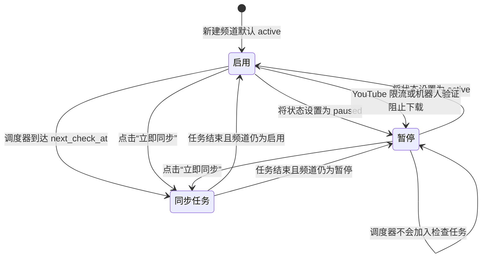
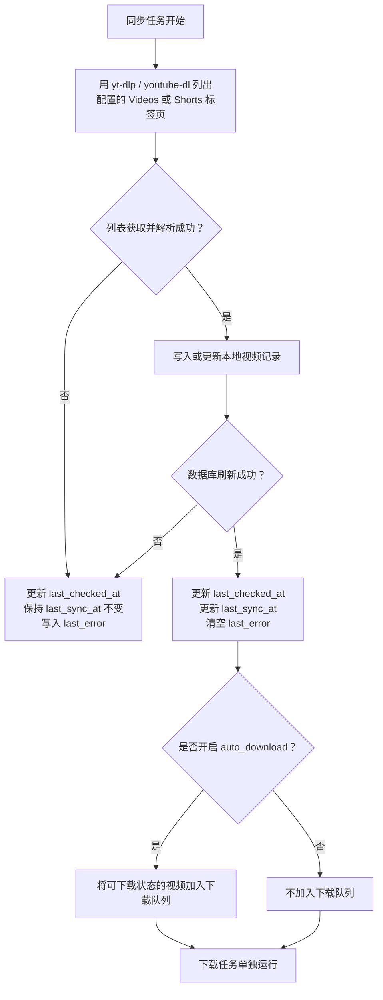
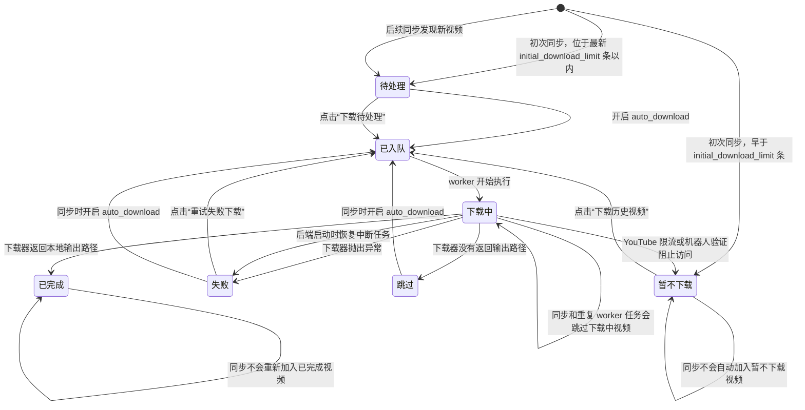

# Video Transporter

中文说明文档。English version: [readme.md](./readme.md)

一个用于管理 YouTube 频道并自动下载视频的项目骨架。

## 技术选型

- 后端: FastAPI + SQLAlchemy + APScheduler + SQLite
- 前端: React + Vite + TypeScript
- 下载器: `bin/ytp-dl.exe`
- 优先下载器: `bin/yt-dlp.exe`，不存在时回退到 `bin/youtube-dl.exe`
- Python 环境管理: `uv`

## 已实现能力

- YouTube 频道增删改查
- 每个频道任务可选择扫描 Videos 标签页或 Shorts 标签页
- 新增频道任务时可根据 URL 自动识别频道名称
- 新增频道后触发一次性全量同步
- 定时轮询频道并发现新视频后自动下载
- Web Console 管理频道与查看视频下载记录

## 目录结构

```text
backend/
  app/
    api/
    services/
frontend/
bin/
data/
downloads/
```

## 后端启动

```bash
uv sync
uv run uvicorn backend.app.main:app --reload
```

## 前端启动

```bash
cd frontend
npm install
npm run dev
```

开发模式下前端默认运行在 `http://127.0.0.1:5173`，并自动代理到后端接口。

## Windows 一键启动

```powershell
.\start-dev.cmd
```

该命令会分别打开前后端终端窗口，并在启动前自动执行后端的 `uv sync` 与前端的 `npm install`，随后启动两个开发服务。

## macOS 和 Linux 一键启动

```bash
chmod +x ./start-dev.sh
./start-dev.sh
```

该命令会在当前终端中同时运行前后端，并在启动前自动执行后端的 `uv sync` 与前端的 `npm install`，随后一起启动两个开发服务。

## 日志输出

- 应用与接口日志: `logs/app.log`
- 下载专用日志: `logs/download.log`
- 两类日志都会同时输出到后端启动终端
- 日志按天滚动，默认保留 14 天

## 频道状态模型

频道状态字段描述的是两个相关但彼此独立的概念：

- `status`: 频道是否参与自动定时检查。
- `scan_type`: 该频道任务扫描的 YouTube 标签页，只能是 `videos` 或 `shorts`，默认是 `videos`；Shorts 频道名称会自动加上 ` - Shorts` 后缀。
- `last_checked_at`: 系统最近一次尝试检查频道的时间。成功和失败都会更新这个值。
- `last_sync_at`: 最近一次频道检查成功完成，并刷新本地视频记录的时间。
- `next_check_at`: 调度器计划的下一次自动检查时间。暂停频道不会有下一次自动检查时间。
- `last_error`: 最近一次检查失败的原因，系统会尽量归类成可读的错误类型。

`active` 和 `paused` 是配置状态，不是后台任务运行状态。暂停频道不会参与定时自动检查，但当前实现仍允许手动同步。



每一次同步任务都会尝试列出频道配置的标签页，并写入本地数据库。频道 URL 会根据 `scan_type` 规范化为 `/videos` 或 `/shorts`，所以同一个 YouTube 频道可以拆成独立的 Videos 与 Shorts 任务。



简而言之，`last_checked_at` 回答“系统上次什么时候试过？”，`last_sync_at` 回答“频道列表上次什么时候成功刷新？”。视频下载是独立任务，不会更新这两个频道时间戳。

## 视频下载状态模型

视频下载状态描述每条已发现视频的下载生命周期：

- `pending`: 待处理，视频符合下载策略，但还没有开始下载。
- `deferred`: 暂不下载，视频被有意延后处理。包括初次存量回填时超过频道 `initial_download_limit` 的较早视频，以及因 YouTube 限流或机器人验证被延后的下载。页面显示为“暂不下载”，仍可手动下载。
- `downloading`: 下载中，下载 worker 已经开始处理这条视频。
- `completed`: 已完成，视频已下载成功，并记录了本地 `download_path`。
- `failed`: 失败，下载过程出错，或后端启动时发现上次停在 `downloading` 的中断任务。
- `skipped`: 跳过，下载器执行结束，但没有返回可记录的本地输出路径。

系统还有一个不写入数据库的隐含 `queued` 状态：视频已经提交到 worker 线程池，但在 worker 真正开始前，数据库仍显示原来的状态。

`initial_download_limit` 默认是 `20`。频道首次成功同步时，最新的 `initial_download_limit` 条视频会创建为 `pending`；超过数量限制的更早历史视频会创建为 `deferred`。后续同步发现的新发布视频仍会创建为 `pending`，因此新视频仍可自动下载。



手动下载动作不要求频道必须是 `active`：

- “下载待处理”会加入最新的 `pending` 视频。
- “下载历史视频”会加入最新的 `deferred` 视频。
- “重试失败下载”会加入最近失败的 `failed` 视频。
- “立即同步”会刷新频道视频列表，并且只在开启 `auto_download` 时加入可自动下载的状态。

## 下载说明

- 程序会优先使用 `bin/yt-dlp.exe`
- 如果希望 `yt-dlp` 将分离的视频流和音频流自动合并成一个完整文件，请确保 `ffmpeg` 可用：可以放在项目的 `bin/ffmpeg.exe`、`bin/ffmpeg`，或放在系统 `PATH` 中
- 如果没有 `ffmpeg`，下载器会尽量回退到单文件格式，保证结果仍然包含音频和视频，但可用分辨率可能会更受限制
- 在 `bin/` 中放入或替换 `ffmpeg`，或调整系统 `PATH` 后，需要重启后端服务，下载器才会重新检测到它
- 如果项目根目录存在 `cookies.txt`，会自动在下载时带上 cookies
- 默认使用单个下载 worker，减少并发请求
- 默认每次下载前会随机等待 8 到 20 秒，避免过于密集地请求 YouTube
- 如果下载时 YouTube 返回限流、机器人验证、cookies 或登录要求，程序会将当前视频延后为 `deferred`，并暂停频道，避免已排队的自动下载继续请求。添加或刷新 `cookies.txt`，等待限制解除后，可以重新启用频道或手动触发下载。
- 失败任务支持按“最近失败的前 N 个”重新加入队列，默认 20 个
- 可通过 `.env` 覆盖：
  - `VIDEO_TRANSPORTER_YT_DLP_PATH`
  - `VIDEO_TRANSPORTER_YOUTUBE_DL_PATH`
  - `VIDEO_TRANSPORTER_YOUTUBE_COOKIES_PATH`
  - `VIDEO_TRANSPORTER_DOWNLOAD_INTERVAL_MIN_SECONDS`
  - `VIDEO_TRANSPORTER_DOWNLOAD_INTERVAL_MAX_SECONDS`
