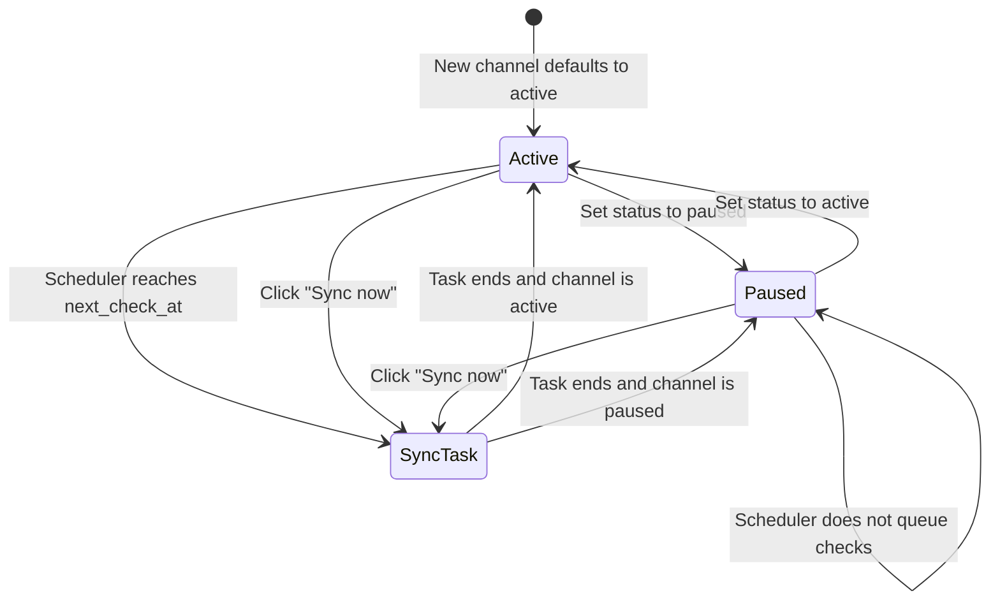
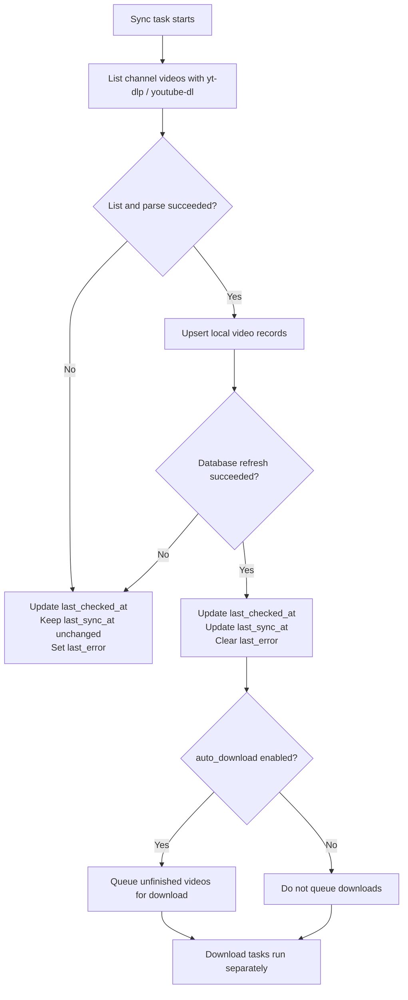

# Video Transporter

English documentation. 中文版请见 [README.zh-CN.md](./README.zh-CN.md)

A project scaffold for managing YouTube channels and downloading videos automatically.

## Tech Stack

- Backend: FastAPI + SQLAlchemy + APScheduler + SQLite
- Frontend: React + Vite + TypeScript
- Downloader: `bin/ytp-dl.exe`
- Preferred downloader: `bin/yt-dlp.exe`, with fallback to `bin/youtube-dl.exe`
- Python environment management: `uv`

## Implemented Features

- Create, update, and delete YouTube channels
- Trigger a one-time full sync after adding a new channel
- Poll channels on a schedule and automatically download newly discovered videos
- Web console for channel management and download record viewing

## Project Structure

```text
backend/
  app/
    api/
    services/
frontend/
bin/
data/
downloads/
```

## Start the Backend

```bash
uv sync
uv run uvicorn backend.app.main:app --reload
```

## Start the Frontend

```bash
cd frontend
npm install
npm run dev
```

In development mode, the frontend runs on `http://127.0.0.1:5173` by default and proxies API requests to the backend automatically.

## One-Click Startup on Windows

```powershell
.\start-dev.cmd
```

This opens separate terminal windows for the backend and frontend, runs `uv sync` for the backend, and `npm install` for the frontend before starting both dev servers.

## One-Click Startup on macOS and Linux

```bash
chmod +x ./start-dev.sh
./start-dev.sh
```

This runs the backend and frontend in the current terminal, starts `uv sync` for the backend and `npm install` for the frontend first, and then launches both dev servers together.

## Logging

- Application and API logs: `logs/app.log`
- Download-specific logs: `logs/download.log`
- Both log streams are also printed to the backend terminal
- Logs rotate daily and are retained for 14 days by default

## Channel State Model

The channel state fields describe two related but separate concepts:

- `status`: Whether the channel participates in automatic scheduled checks.
- `last_checked_at`: The most recent time the system attempted a channel check. Successful and failed attempts both update this value.
- `last_sync_at`: The most recent time a channel check completed successfully and refreshed local video records.
- `next_check_at`: The scheduler's next planned automatic check time. Paused channels do not have a scheduled next check.
- `last_error`: The reason for the most recent failed check, grouped into a readable category when possible.

`active` and `paused` are configuration states, not runtime task states. A paused channel is excluded from scheduled automatic checks, but the current implementation still allows manual sync.



Each sync task attempts to list the channel videos and write them to the local database:



In short, `last_checked_at` answers "when did the system last try?", while `last_sync_at` answers "when did the channel list last refresh successfully?". Video downloads are separate tasks and do not update either channel timestamp.

## Download Notes

- The app prefers `bin/yt-dlp.exe`
- If you want yt-dlp to merge separate video/audio streams into a single complete file, make `ffmpeg` available either as `bin/ffmpeg.exe`, `bin/ffmpeg`, or via your system `PATH`
- If `ffmpeg` is not available, the downloader falls back to a single-file format when possible so the result still includes both video and audio, but available resolutions may be more limited
- After adding or replacing `ffmpeg` in `bin/` or on your system `PATH`, restart the backend service so the downloader can detect it again
- If `cookies.txt` exists in the project root, it is automatically used for downloads
- Downloads run with a single worker by default to reduce concurrent requests
- A random 8 to 20 second interval is applied before each download by default to avoid overly aggressive requests to YouTube
- Failed tasks can be re-queued by selecting the most recent failed `N` items, with a default of 20
- The following values can be overridden via `.env`:
  - `VIDEO_TRANSPORTER_YT_DLP_PATH`
  - `VIDEO_TRANSPORTER_YOUTUBE_DL_PATH`
  - `VIDEO_TRANSPORTER_YOUTUBE_COOKIES_PATH`
  - `VIDEO_TRANSPORTER_DOWNLOAD_INTERVAL_MIN_SECONDS`
  - `VIDEO_TRANSPORTER_DOWNLOAD_INTERVAL_MAX_SECONDS`
